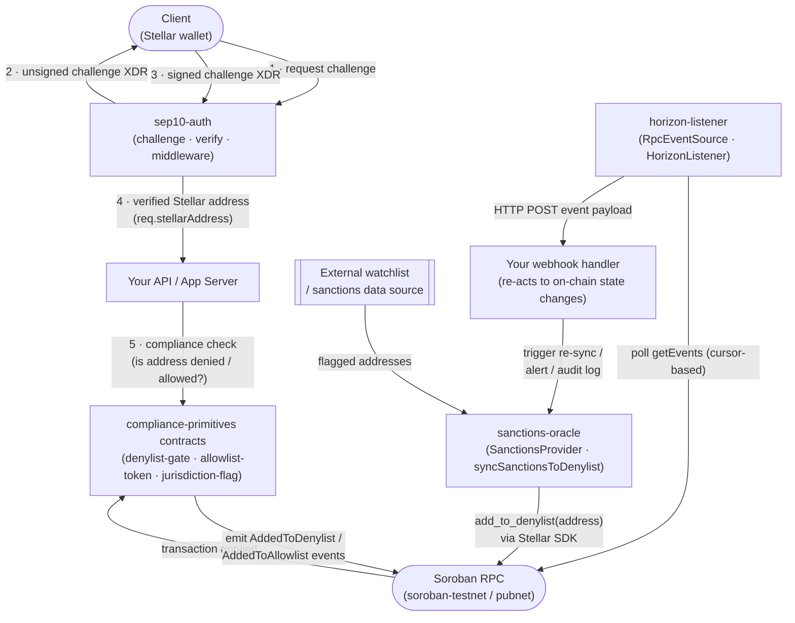

# compliance-adapters

[](https://github.com/stellar-compliance-kit/compliance-adapters/actions/workflows/ci.yml)

Integration adapters connecting Stellar compliance primitives to SEP-10 auth, sanctions oracles, and Horizon/RPC event streams.

Having on-chain compliance controls — allowlists, denylists, jurisdiction flags — is only half the problem. To actually run a compliant app on Stellar, teams still need to verify who's making a request, feed real-world watchlist data into those on-chain controls, and react when compliance state changes. That's a lot of repetitive off-chain glue: SEP-10 authentication, syncing external sanctions data, listening for contract events. This repo provides ready-made, well-tested adapters for that glue layer so app developers don't have to hand-roll it for every project.

## Relationship to `compliance-primitives`

This repo consumes the on-chain Soroban contracts defined in
[`compliance-primitives`](https://github.com/stellar-compliance-kit/compliance-primitives) —
`allowlist-token`, `denylist-gate`, and `jurisdiction-flag`. It does not vendor or reimplement
those contracts; adapters here call into deployed instances of them (or listen for events they
emit) via `@stellar/stellar-sdk`. If you're looking for the on-chain contract logic itself, that
lives in the other repo.

## What's in this repo

This is a monorepo with three independent packages:

- **[`sep10-auth`](./sep10-auth)** — builds and verifies [SEP-10](https://stellar.org/protocol/sep-10)
  web authentication challenges, so you can confirm a request is really coming from the Stellar
  address it claims to be from before running any compliance check. Includes an example Express
  middleware.
- **[`sanctions-oracle`](./sanctions-oracle)** — a `SanctionsProvider` interface plus a mock
  implementation and a sync script that pushes flagged addresses into a deployed `denylist-gate`
  contract instance.
- **[`horizon-listener`](./horizon-listener)** — an example service that polls Soroban RPC for
  `denylist-gate` / `allowlist-token` contract events and re-emits them to a webhook, as a
  reference pattern for reacting to on-chain compliance state changes.

Each package has its own `README.md`, tests, and `package.json`.

## Architecture

The diagram below shows how the three packages fit together in a typical deployment alongside the on-chain contracts from [`compliance-primitives`](https://github.com/stellar-compliance-kit/compliance-primitives).



**Flow summary:**

1. `sep10-auth` authenticates the caller's Stellar address before any compliance check runs.
2. Your app server queries the on-chain `denylist-gate` / `allowlist-token` / `jurisdiction-flag` contracts to decide whether the authenticated address is permitted.
3. `sanctions-oracle` periodically pulls flagged addresses from an external watchlist and pushes them into `denylist-gate` via Soroban RPC.
4. `horizon-listener` polls Soroban RPC for contract events (e.g. `AddedToDenylist`) and forwards them to a webhook, allowing downstream services to react to on-chain state changes in near-real-time — for example by triggering a fresh `sanctions-oracle` sync.

## Quick start

Requires Node 20+.

```bash
git clone https://github.com/stellar-compliance-kit/compliance-adapters.git
cd compliance-adapters
npm install

# run every package's test suite
npm test

# run a single package's tests
npm test --workspace=sep10-auth

# build all packages
npm run build
```

### Working with a single package

If you only need to work on one adapter:

```bash
# Install and test sep10-auth
npm install --workspace=sep10-auth
npm test --workspace=sep10-auth

# Install and test sanctions-oracle
npm install --workspace=sanctions-oracle
npm test --workspace=sanctions-oracle

# Install and test horizon-listener
npm install --workspace=horizon-listener
npm test --workspace=horizon-listener
```

To try the sanctions sync script against testnet in dry-run mode (no transactions submitted, just
logs what it would do):

```bash
npm run build --workspace=sanctions-oracle
node sanctions-oracle/dist/sync.js --dry-run --addresses ./sanctions-oracle/test/fixtures/addresses.json
```

See each package's README for its full API and configuration options.

## Changelog

See [CHANGELOG.md](./CHANGELOG.md) for release notes and version history.

## Contributing

Contributions welcome — see [CONTRIBUTING.md](./CONTRIBUTING.md) for setup and workflow details.
This repo participates in the [Drips Wave](https://www.drips.network/) Stellar Program and is
deliberately kept full of small, well-scoped issues. Open issues are labeled by complexity
(`complexity: trivial`, `complexity: medium`, `complexity: high`) so you can pick work that
matches your available time — trivial issues are also tagged `good first issue` and don't require
Soroban expertise.

## Disclaimer

The `sanctions-oracle` package's bundled mock provider is a **placeholder for development and
testing only**. It contains no real sanctions or watchlist data and **must not be used as an
actual compliance data source in production**. Integrate a real, licensed sanctions/watchlist
data provider before relying on this package for real compliance decisions.

## License

[MIT](./LICENSE)
